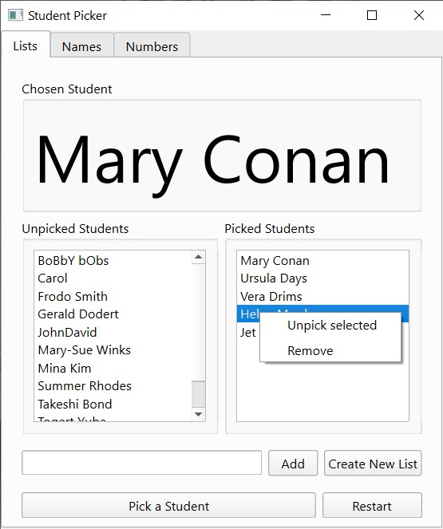

# sPicker
Utility to help teachers randomly pick students during class activities. Mostly created as a self-learning project.

Created in python with pyQT6. Work in progress. Dependencies aren't currently provided.

